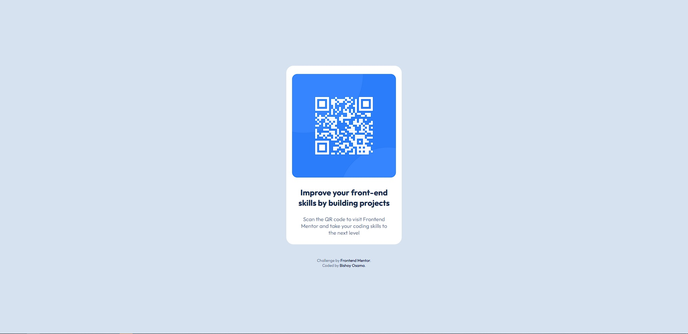

# Frontend Mentor - QR code component solution

This is a solution to the [QR code component challenge on Frontend Mentor](https://www.frontendmentor.io/challenges/qr-code-component-iux_sIO_H). Frontend Mentor challenges help you improve your coding skills by building realistic projects.

## Table of contents

* [Frontend Mentor - QR code component solution](#frontend-mentor---qr-code-component-solution)
* [Table of contents](#table-of-contents)
* [Screenshot](#screenshot)
* [Links](#links)
* [Built with](#built-with)
* [Author](#author)

### Screenshot

### Links

* Solution URL: [https://github.com/BishoyOsama96/Frontend-Mentor-qr-code-component](https://github.com/BishoyOsama96/Frontend-Mentor-qr-code-component)
* Live Site URL: [[Add live site URL here](https://bishoyosama96.github.io/Frontend-Mentor-qr-code-component/)](https://bishoyosama96.github.io/Frontend-Mentor-qr-code-component/)

### Built with

* Semantic HTML5 markup
* CSS custom properties
* Flexbox

## Author

* Website - [Bishoy Osama](https://github.com/BishoyOsama96)
* Frontend Mentor - [@BishoyOsama96](https://www.frontendmentor.io/profile/BishoyOsama96)
* LinkedIn - [Bishoy Osama](https://www.linkedin.com/in/bishoy-osama/)
